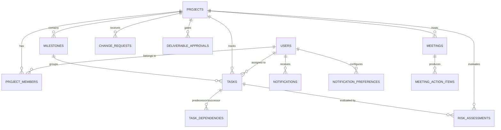

# Intelix Project Context & Codebase Architecture

> **Repository**: `c:\Users\Kunal\OneDrive\Desktop\sih`  
> **Platform Name**: INTELIX — AI Project Execution Intelligence Platform  
> **Status**: Development & Integration Ready (Spring Boot 3 + React 18 + PostgreSQL + FastAPI ML + WebSocket/STOMP)

---

## 1. Project Purpose
INTELIX is an enterprise-grade project execution and decision intelligence platform designed to replace passive project trackers with an active, predictive monitoring system. It aggregates telemetry across tasks, Finish-to-Start (FS) dependencies, developer workloads, blockers, client change requests, and deliverable approvals to:
1. Detect execution risks proactively using heuristic and machine learning scoring.
2. Forecast completion delays via velocity and critical-path delay cascade propagation.
3. Offer actionable 1-click AI Copilot intervention recommendations (workload rebalancing, task unblocking, capacity adjustments).
4. Synchronize state across all stakeholders in real time via authenticated WebSocket/STOMP streams without page refreshes.

---

## 2. Technology Stack

| Layer | Technology | Version / Spec | Implementation Status |
| :--- | :--- | :--- | :--- |
| **Frontend Framework** | React + Vite | React 18.2, Vite 8.2.2 | **IMPLEMENTED** |
| **Styling & Icons** | Tailwind CSS + Lucide React | Tailwind v4, Lucide 0.344 | **IMPLEMENTED** |
| **Charts & Visualization** | Recharts | 2.12.2 | **IMPLEMENTED** |
| **State & Context** | React Context API | `ProjectContext`, `RealtimeNotificationContext` | **IMPLEMENTED** |
| **Real-Time Client** | `@stomp/stompjs` + SockJS client | StompJS 7.0.0, SockJS-client 1.6.1 | **IMPLEMENTED** |
| **Backend Framework** | Spring Boot | 3.3.4 (Java 21) | **IMPLEMENTED** |
| **Persistence / ORM** | Spring Data JPA / Hibernate | 6.5.3.Final | **IMPLEMENTED** |
| **Security & Auth** | Spring Security + JJWT | 0.12.6 (HMAC-SHA256 Stateless) | **IMPLEMENTED** |
| **Real-Time Server** | Spring WebSocket + STOMP | `spring-boot-starter-websocket` | **IMPLEMENTED** |
| **Relational Database** | PostgreSQL | 16 (PostgreSQL dialect) | **IMPLEMENTED** |
| **Database Migrations** | SQL Scripts | `database/migrations/V1-V4` | **IMPLEMENTED** |
| **ML Intelligence** | Python FastAPI + Uvicorn | Python 3.12/3.14, FastAPI 0.110 | **IMPLEMENTED** |
| **Containerization** | Docker Compose | Multi-container setup | **IMPLEMENTED** |

---

## 3. Repository Structure

```
sih/
├── backend/                              # Spring Boot 3 Java 21 REST API & WebSocket Server
│   ├── pom.xml                           # Maven dependencies (JPA, Security, JJWT, WebSocket)
│   ├── run-backend.bat                   # Windows batch runner
│   └── src/
│       ├── main/
│       │   ├── java/com/platform/
│       │   │   ├── ProjectPlatformApplication.java
│       │   │   ├── config/               # Security, JWT, WebSocket & STOMP Interceptors
│       │   │   ├── controller/           # 18 REST Controllers
│       │   │   ├── data/                 # In-Memory & DB Initializers
│       │   │   ├── dto/                  # Request/Response DTOs & RealtimeEvent
│       │   │   ├── entity/               # 20 JPA Relational Entities
│       │   │   ├── exception/            # Global Exception Mesh
│       │   │   ├── repository/           # 17 Spring Data JPA Repositories
│       │   │   └── service/              # 17 Business & Intelligence Services
│       │   └── resources/
│       │       └── application.yml       # Environment-driven Spring configuration
│       └── test/                         # JUnit 5 & Mockito test suites
├── frontend/                             # React 18 SPA (Vite)
│   ├── package.json                      # NPM dependencies
│   ├── vite.config.js                    # Vite dev server + /api and /ws proxy config
│   └── src/
│       ├── App.jsx                       # Main Router & Realtime Sync Layer
│       ├── components/                   # 13 Reusable UI & Modal components
│       ├── context/                      # Global state (ProjectContext, RealtimeNotificationContext)
│       ├── services/                     # API client (api.js) & ML engine fallback (mlEngine.js)
│       ├── utils/                        # Audio notification generator (Web Audio API)
│       └── views/                        # 18 Role-specific views & dashboards
├── database/                             # Database infrastructure
│   ├── README.md                         # ER diagram & seed credential docs
│   └── migrations/
│       ├── V1__initial_schema.sql        # 20 Relational tables with constraints
│       ├── V2__constraints_and_indexes.sql# Foreign keys & performance indexes
│       ├── V3__seed_data.sql             # Demo personas & SCMS enterprise project
│       └── V4__notifications_extended.sql# Extended notifications & preferences
├── ml/                                   # Python ML Microservice
│   ├── main.py                           # FastAPI /predict and /health service (Port 8000)
│   └── requirements.txt                  # FastAPI, Uvicorn, Pydantic
├── docker-compose.yml                    # Multi-container orchestration (DB, API, Frontend)
└── .env.example                          # Environment variable template
```

---

## 4. System Architecture

```
                                  BROWSER CLIENT (React 18 SPA)
                                                │
                     ┌──────────────────────────┴──────────────────────────┐
                     │                                                     │
         REST API Requests (JWT Bearer)                         WebSocket STOMP (/ws)
                     │                                                     │
                     ▼                                                     ▼
           Spring Boot Web Tier                               WebSocket Channel Interceptor
     (18 Controllers + Security Filter)                     (JWT Validation + Topic Authorization)
                     │                                                     │
                     ▼                                                     ▼
              Service Mesh ────────────────────────────────────── NotificationService
   (Tasks, Risks, Approvals, CRs, Copilot)                   (Unicast & Multicast Dispatch)
          │                   │                                            │
          ▼                   ▼                                            ▼
   FastAPI ML (Port 8000)  JPA Repositories ───────────────► PostgreSQL 16 Database
```

---

## 5. User Roles & Access Boundaries

1. **Project Manager (`ROLE_MANAGER`)**:
   - Capabilities: Full portfolio management, WBS task creation/assignment, risk monitoring, dependency chaining, CR approval/rejection, AI copilot 1-click execution, team capacity monitoring.
   - Default Demo Account: `manager@demo.com` / `password123` (Sarah Jenkins).
2. **Developer / Employee (`ROLE_EMPLOYEE`)**:
   - Capabilities: Execution cockpit, assigned tasks, effort hour logging, progress updates, blocker reporting (`isBlocked = true`), branch/PR linkage.
   - Default Demo Account: `developer@demo.com` / `password123` (Alex Chen).
3. **Client / Stakeholder (`ROLE_CLIENT`)**:
   - Capabilities: Milestone deliverable review & formal sign-off (Approve / Request Changes), Change Request creation with budget/time estimation, high-level project health view.
   - Default Demo Account: `client@demo.com` / `password123` (David Vance).
4. **Executive / Leadership (`ROLE_EXECUTIVE`)**:
   - Capabilities: Portfolio command center, cross-project health indices, budget burn rates, risk tier distribution.
   - Default Demo Account: `executive@demo.com` / `password123` (Elena Rostova).
5. **Platform Administrator (`ROLE_ADMIN`)**:
   - Capabilities: System governance, user provisioning, role assignments, audit log review.
   - Default Demo Account: `admin@demo.com` / `password123` (Marcus Vance).

---

## 6. Frontend Architecture & Page Mapping

| View / Page | Key Components | Data Source / APIs | Target Roles | Status |
| :--- | :--- | :--- | :--- | :--- |
| **OverviewView** | HealthRing, Metric, IntelixIntelligenceCard, RiskCard | `/api/projects/{id}`, `/workload`, `/copilot/recommendations` | All (Role-adaptive) | **IMPLEMENTED** |
| **TasksView** | CreateTaskModal, Kanban board, Task Table | `/api/projects/{id}/tasks`, `/api/tasks/{id}/status`, `/blocker` | Manager, Developer | **IMPLEMENTED** |
| **RiskCenterView** | 5-Factor Risk Breakdown, Radar/Bar charts | `/api/risk/project/{id}`, `/api/projects/{id}/risk-breakdown` | Manager, Executive | **IMPLEMENTED** |
| **DependenciesView** | Interactive DAG / FS Cascade Network | `/api/dependencies`, `/api/projects/{id}/tasks` | Manager, Developer | **IMPLEMENTED** |
| **TimelineView** | Gantt Timeline & Milestone markers | `/api/milestones`, `/api/projects/{id}/tasks` | Manager, Client, Exec | **IMPLEMENTED** |
| **ChangeRequestsView**| CR Submission modal, Impact breakdown | `/api/projects/{id}/change-requests`, `/convert-to-task` | Client, Manager | **IMPLEMENTED** |
| **ApprovalsView** | Deliverable sign-off modal, Version history | `/api/approvals`, `/api/approvals/{id}/decision` | Client, Manager | **IMPLEMENTED** |
| **NotificationsView**| Category tabs, Preferences modal | `/api/notifications`, `/preferences`, `/read` | All | **IMPLEMENTED** |
| **WorkloadView** | Capacity meters, Allocation breakdown | `/api/projects/{id}/workload` | Manager | **IMPLEMENTED** |
| **AnalyticsView** | EVM charts (CPI, SPI), Burndown curves | `/api/analytics/project/{id}`, `/metrics` | Manager, Executive | **IMPLEMENTED** |
| **MeetingsView** | Agenda viewer, Action item assigner | `/api/meetings/project/{id}` | All | **IMPLEMENTED** |
| **DocumentsView** | File upload & document list | `/api/documents/project/{id}` | All | **IMPLEMENTED** |
| **UsersView** | User management & role assignment | `/api/users` | Admin, Manager | **IMPLEMENTED** |

---

## 7. Backend Architecture & Controller Mapping

| Controller | Service Layer | Main Endpoints | Responsibility |
| :--- | :--- | :--- | :--- |
| **AuthController** | `AuthService`, `JwtTokenProvider` | `POST /api/auth/login`, `GET /api/auth/me` | Authentication & token issue |
| **ProjectController** | `ProjectService` | `GET /api/projects`, `POST /api/projects` | Project metadata & WBS root |
| **TaskController** | `TaskService`, `RiskEngineService` | `GET /api/projects/{id}/tasks`, `PATCH /status`, `POST /blocker` | Task CRUD, status mutation, blocker alerts |
| **RiskController** | `RiskEngineService` | `GET /api/risk/project/{id}`, `GET /api/risk/tasks/{id}` | Heuristic 5-factor risk scoring |
| **DependencyController**| `DependencyService` | `GET /api/dependencies`, `POST /api/dependencies` | Finish-to-Start DAG constraint management |
| **ChangeRequestController**| `ChangeRequestService` | `GET /api/projects/{id}/change-requests`, `POST /convert-to-task` | CR lifecycle & task conversion |
| **ApprovalController** | `ApprovalService` | `GET /api/approvals`, `POST /api/approvals/{id}/decision` | Deliverable gatekeeping |
| **NotificationController**| `NotificationService` | `GET /api/notifications`, `GET /unread-count`, `PUT /preferences`| Paginated alerts & user preferences |
| **AiCopilotController**| `AiCopilotService` | `GET /api/copilot/recommendations/{id}`, `POST /execute` | Telemetry rule evaluation & 1-click execution |
| **PredictionController**| `PredictionService` | `GET /api/predictions/project/{id}` | Velocity & delay estimation |
| **AnalyticsController**| `AnalyticsService` | `GET /api/analytics/project/{id}` | Earned value metrics (CPI/SPI) & burndown |
| **MeetingController** | `MeetingService` | `GET /api/meetings/project/{id}`, `POST /action-items` | Calendar sync & action item assignments |
| **DocumentController**| `DocumentService` | `GET /api/documents/project/{id}` | Document repository metadata |
| **WorkloadController**| `WorkloadService` | `GET /api/projects/{id}/workload` | Developer weekly capacity calculation |

---

## 8. Database Architecture & Relationships



---

## 9. Real-Time Notification & Live Dashboard Architecture

1. **Transport**: STOMP over WebSocket with SockJS fallback (`/ws`).
2. **Personal Alerts**: Pushed unicast to `/user/{userId}/queue/notifications`.
3. **Dynamic Counter**: Unread badge count pushed to `/user/{userId}/queue/unread-count`.
4. **Project Telemetry**: Broadcast to `/topic/project/{projectId}` for instant Kanban status switches (`BLOCKED`, `DONE`) and risk recalculations.
5. **Preference Filtering**: `NotificationPreference` checks prevent unwanted notifications; `CRITICAL` alerts are non-suppressible.
6. **Persistence & Offline Delivery**: All notifications persist in PostgreSQL with audit timestamps; offline users fetch historical alerts on reconnect.

---

## 10. Algorithmic Risk & Prediction Engine

### A. 5-Factor Weighted Risk Engine (RiskEngineService.java)
$$\text{Task Risk} = (0.30 \times \text{ProgressLag}) + (0.25 \times \text{DeadlineProximity}) + (0.20 \times \text{DependencyChoke}) + (0.15 \times \text{WorkloadOverload}) + (0.10 \times \text{BlockerSeverity})$$

- **Progress Lag (30%)**: Compares elapsed calendar duration $\frac{\text{Today} - \text{StartDate}}{\text{DueDate} - \text{StartDate}}$ against actual percentage progress.
- **Deadline Proximity (25%)**: Exponential penalty when $\text{DaysRemaining} \le 2$ with progress $< 70\%$.
- **Dependency Choke (20%)**: Evaluates incomplete upstream predecessor tasks, adding extra weight if predecessors are blocked or overdue.
- **Workload Overload (15%)**: Evaluates developer active task hours vs. weekly capacity ($> 100\%$ capacity adds progressive risk).
- **Blocker Factor (10%)**: $100$ penalty if active blocker flag is present.

### B. Prediction & Delay Propagation
- Computes velocity: $v = \frac{\Delta\text{Progress}}{\Delta\text{Days}}$.
- Estimates projected completion date and cascading slip days across the FS dependency network.

---

## 11. AI Copilot & 1-Click Interventions (AiCopilotService.java)
The AI Copilot continuously evaluates active project telemetry:
1. **Workload Imbalance Rule**: Detects developers with $>120\%$ capacity and generates a 1-click rebalancing recommendation.
2. **Critical Dependency Choke Rule**: Identifies lagging critical path tasks (e.g. `SCMS-101`) and recommends adding a pair developer to recover slip.
3. **Blocker Escalation Rule**: Detects active blockers and creates an escalation item for infrastructure/DevOps teams.
4. **1-Click Execution**: Calling `POST /api/copilot/execute` dynamically applies the action, reallocates hours, resolves blockers, and persists the audit log.

---

## 12. Implementation Maturity & Status

| Functional Area | Maturity Score | Status & Notes |
| :--- | :--- | :--- |
| **Frontend UI / Views** | **95%** | 18 full views, dark theme, responsive navigation, modals, toasts. |
| **Backend REST APIs** | **95%** | 18 Spring Boot controllers covering all domain endpoints. |
| **Database & Migrations** | **95%** | 20 tables in PostgreSQL with Flyway-ready migration scripts (V1-V4). |
| **Authentication & JWT** | **95%** | Stateless HMAC-SHA256 JWT validation, role-based endpoint protection. |
| **Real-Time WebSocket/STOMP** | **95%** | Live push notifications, unread count sync, project telemetry broadcast. |
| **Risk & Heuristic Engine** | **90%** | 5-factor scoring in Java backend, threshold-crossing transition alerts. |
| **AI Copilot & Recommendations**| **85%** | Rule-based telemetry evaluation and 1-click action execution engine. |
| **ML Intelligence Microservice** | **80%** | FastAPI Python service on port 8000 with `/predict` endpoint. |
| **Overall MVP Maturity** | **92%** | End-to-end integrated and fully verified across all user personas. |

---

## 13. Known Technical Debt & Future Enhancements

1. **In-Memory Simple Broker**: Currently configured with Spring's built-in `enableSimpleBroker`. In high-scale horizontal multi-instance deployments, integrate an external STOMP broker relay (e.g., RabbitMQ or Redis Pub/Sub).
2. **Direct File Storage**: `ProjectDocument` stores metadata; physical file storage is local. For cloud deployments, attach an AWS S3 / MinIO storage adapter.
3. **Automated ML Training Loop**: The FastAPI ML service uses heuristic regression; historical project datasets can be fed into an offline training pipeline (e.g. XGBoost) for deeper confidence calibration.
